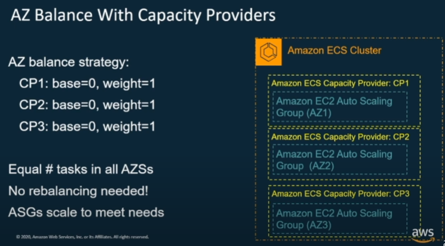

# Terraform AWS Demo for ECS, Capacity Provider, Fargate

This is a Terraform implementation of the ECS, Capacity Provider and Fargate, based on [the youtube video "Deep Dive on Amazon ECS Capacity Providers"](https://www.youtube.com/watch?v=Vb_4wAEcfpQ)

It builds the ECS Cluster infrastructure based on that video:


For Forgate, you can experiment with the capacity provider's base and weight as explained in the video:


The weight can be changed in the [create_ecs_infrastructure.tf](create_ecs_infrastructure.tf) file:
```
    capacity_provider_strategy = concat(
        [
            {
                capacity_provider_name = "FARGATE"
                base = 0
                weight =  1
            },
            {
                capacity_provider_name = "FARGATE_SPOT"
                base = 0
                weight =  1
            }

        ],
```

This project demonstrates the use of these technologies: AWS IAM Role and Policy, VPC, Codepipeline, ECS, Fargate, EC2, Terraform, Docker, CodePipeline

# CodePipeline
Moreover, a codepipeline is setup to autmatically build an [example node js app](https://github.com/andrewlau4/AwsECSDemoDockerImage) into a docker image; and then push that image into the ECR registry, and then deploy it as ECS service.

To use the codepipeline, your AWS CodePipeline must have a connection to the source repository. You can fork the  [example node js app](https://github.com/andrewlau4/AwsECSDemoDockerImage). Then follow the [GitHub instruction](https://docs.aws.amazon.com/dtconsole/latest/userguide/connections-create-github.html) to set it up.

Then run this terraform command to setup the CodePipeline:

```
terraform apply -var="enable_code_pipeline=true" -var="codestar_git_source_connection_name=<your_source_code_connection>" -var="source_repo_url=<your_docker_app_repository>"
```


# EC2 and Capacity Provider

To enable EC2, use below command:

```
terraform apply -var="enable_ec2_service=true" -var="num_of_default_avail_zones_to_use=<number>"
```

or

```
terraform apply -var="enable_ec2_service=true" -var='avail_zones_to_deploy_autoscale_capacity_provider=["us-east-1a","us-east-1b"]'
```

This will deployed the EC2 task as described in [the youtube video "Deep Dive on Amazon ECS Capacity Providers"](https://www.youtube.com/watch?v=Vb_4wAEcfpQ)



WARNING: The desired_count of ECS-EC2 service is by default set to 0 to avoid EC2 instances being start-up automatically. You need to go to Aws console, click the Update Service button, and set the Desired Tasks count manually (as explained in the [video](https://www.youtube.com/watch?v=Vb_4wAEcfpQ)). To clean up, you need to manually set the Task count back to 0 and wait for the EC2 being destroyed. Before running  'terraform destroy'  for the remaining resources. 

# To Deploy both CodePipeline and EC2
Use this command:
```
terraform apply -var="enable_ec2_service=true" -var="num_of_default_avail_zones_to_use=<number>" -var="enable_code_pipeline=true" -var="codestar_git_source_connection_name=<your_source_code_connection>" -var="source_repo_url=<your_docker_app_repository>"
```