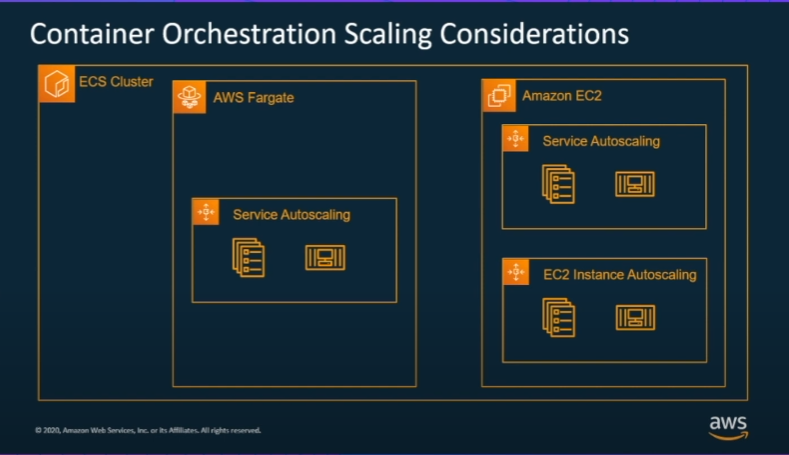
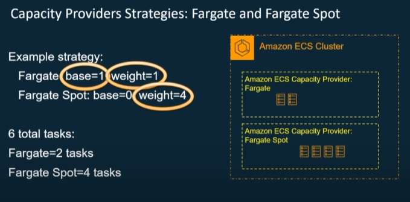

# Terraform AWS Demo for ECS, Capacity Provider, Fargate

This is a Terraform implementation of the ECS, Capacity Provider and Fargate, based on [the youtube video "Deep Dive on Amazon ECS Capacity Providers"](https://www.youtube.com/watch?v=Vb_4wAEcfpQ)

It builds the ECS Cluster infrastructure based on that video:

For Forgate, you can experiment with the capacity provider's base and weight:

